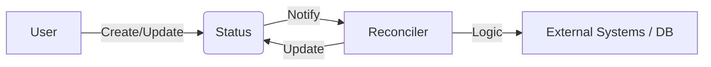

# Halo 2.x Plugin Architecture

Halo 2.x adopts a cloud-native style architecture inspired by Kubernetes. This design separates the **State (Extension)** from the **Logic (Reconciler)**.

## Core Concepts

### 1. Extension (Custom Resource)
Instead of traditional database tables, plugin data is defined as "Extensions". An Extension is a Java class that extends `AbstractExtension`.

Each Extension consists of three parts:
- **Metadata**: Standard fields like `name`, `creationTimestamp`, `labels`.
- **Spec**: The *desired* state (defined by the user).
- **Status**: The *actual* state (reported by the system).

### 2. Reconciler (Controller)
The Reconciler is the brain of the plugin. It operates on a continuous loop:
1.  **Watch**: It listens for changes to specific Extension types.
2.  **Compare**: It checks if the `Spec` (desired) matches the `Status` (actual).
3.  **Act**: If there is a drift, it executes logic to bring the actual state in line with the desired state.
4.  **Update**: It updates the `Status` of the extension.

### 3. Extension Point
Interfaces provided by the Halo Core that allow plugins to inject logic into existing workflows (e.g., `AdditionalWebFilter`, `TemplateHeadProcessor`).

## Data Flow

